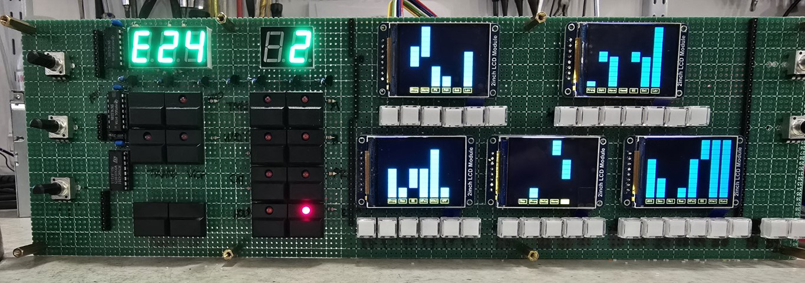

# This project was created to emulate the circuitry and displays used in the Akai AX-80 Polysynth.

I recently purchased both the Akai AX-80 processor board and voice board and managed to get them working to create a polysynth. 

Unfortunately I didn't have the nice AX-80 displays of the 1980's, so I decided that I could decode the original address and data lines of the AX-80 with modern micros and drive OLED screens using the online schematics.

In my use case I was not restricted by the dimensions of the original AX-80 keyboard as this was to be built into a 19" rack unit. Therefore I used 2" SPI IPS displays with 65,000 colours. These are probably too tall and not wide enough to fit the original AX-80 keyboard, but I have found some 3.12" displays that would possibly fill the AX-80 display windows but they are mono and not colour, so it is a bit of a trade off.

In theory you can use any SPI OLED display that is supported by Arduino and simply change the screen width and height in the code to draw the relevant bars. The displays I have used have a very high resolution at 320x240 which allowed me to add some text at the bottom of each column. If you use lower resolution displays then this text might not be possible. I have tried this project with many different resolution screens like 128x64, 128x60 and I believe the 3.12" screen are 256x64.

The schematics show the decoder logic and level conversion from 5V to 3.3v of the original signals, this generates 32 interrupt lines which can be read by 5 ESP32 boards, the 13 address lines carry the segments to be displayed, I simply caputure these with a pair of shift registers every time an interrupt is received and display it on the screen, Each ESP-32 is designed to display upto 8 columns like the original AX-80 VFD displays, but between 5 and 8 are used on each display depending on which section of the synth is it being used for. I used ESP32 boards because they are cheap and easily accessible, I have never used them before, but they have Arduino compatibility which I required for the RoxMux library used to capture the 13 address lines. 

